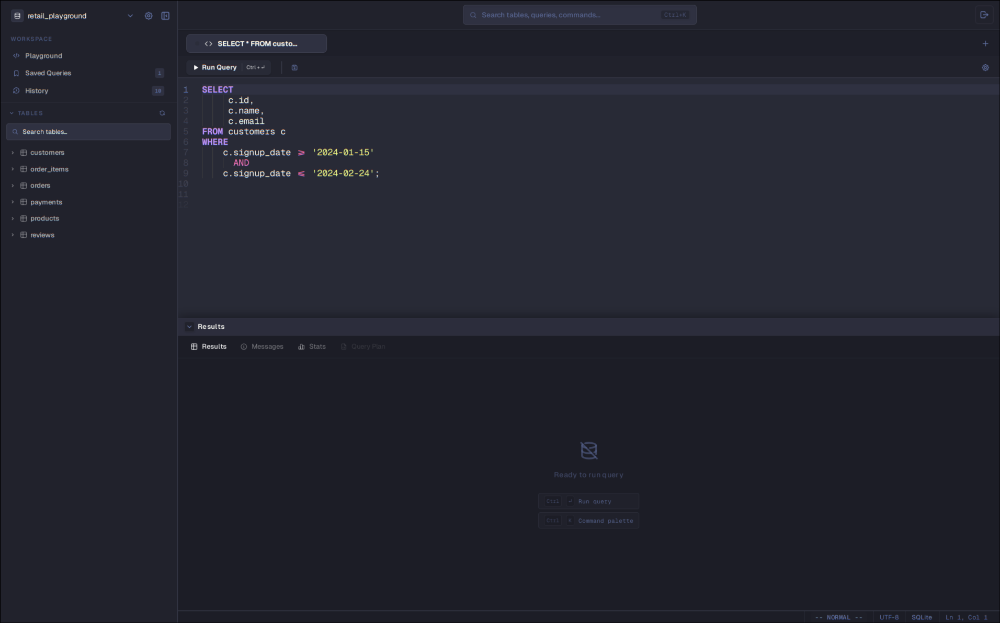

<div align="center">

# SQLose

### Ephemeral SQL Environments. Spin Up. Query. Throw Away.

**A desktop SQL IDE that provisions disposable database environments on demand — local SQLite, ephemeral Postgres/MySQL via Docker, all from a beautiful Electron app.**

<br />



<br />

[](https://www.electronjs.org/)
[](https://react.dev/)
[](https://www.typescriptlang.org/)
[](https://tailwindcss.com/)
[](https://turbo.build/)
[](https://bun.sh/)

[Features](#-features) • [Tech Stack](#-tech-stack) • [Getting Started](#-getting-started) • [Project Structure](#-project-structure) • [Architecture](#-architecture) • [Contributing](#-contributing)

</div>

---

## 📋 Overview

**SQLose** is a developer-focused SQL IDE that makes it dead simple to spin up, query, and discard database environments. No config files. No infrastructure setup. Just pick your database type, and you're running queries in seconds.

### 🎯 Key Benefits

- ⚡ **Ephemeral by design** — Spin up Postgres/MySQL containers, query them, then throw them away when done
- 💻 **Local-first** — SQLite environments run in-process with zero setup
- 🐳 **Docker-powered** — Automatic container lifecycle for Postgres and MySQL
- 🎨 **Beautiful UI** — Monaco Editor, 11 dark themes, Vim bindings, frameless Electron window
- 📊 **Rich results** — Virtualized tables, schema diagrams, CSV export, query history
- 🧪 **10 bundled datasets** — Instant sample data for testing and experimentation

---

## ✨ Features

### 🗄️ Multi-Engine Query Execution

| Engine     | Mode        | Connection                          |
| ---------- | ----------- | ----------------------------------- |
| **SQLite** | Local       | Built-in `sql.js` (in-process)      |
| **PostgreSQL** | Docker container | `pg` driver, auto-provisioned   |
| **MySQL**  | Docker container | `mysql2` driver, auto-provisioned |

Choose your engine on the fly — no config files, no connection strings to remember.

### 🐳 Docker Environment Management

- **Automatic lifecycle**: Pull → Create → Start → Health check → Wait for ready
- **Port allocation**: Dynamic port range (4000–6000), collision-free
- **Orphan cleanup**: Stale containers detected and stopped on startup
- **Health checks**: Waits for database to be accepting connections before use
- **Destruction**: Nuke entire environments — container, volumes, and all

### ✏️ SQL Editor

- **Monaco Editor** — The editor that powers VS Code, with full SQL syntax highlighting
- **Vim Mode** — Optional `monaco-vim` bindings for Vim users
- **Multi-tab** — Open multiple queries side by side with drag-to-reorder tabs
- **Command Palette** — `Ctrl+K` / `Cmd+K` for quick actions, fuzzy search, theme switching
- **Keyboard shortcuts** — Full shortcut system with customizable keybinds

### 📊 Results & Visualization

- **Virtualized table** — Fast rendering of large result sets with virtual scrolling
- **Schema diagram** — Auto-generated ER diagrams powered by React Flow + dagre layout
- **Table browser** — Browse database tables with pagination and column details
- **CSV import** — Import CSV files with automatic schema inference (INTEGER / REAL / TEXT / BOOLEAN)
- **SQL dump import** — Import from SQL dump files
- **Query history** — Full execution log with timestamps, duration, row counts

### 🎨 11 Dark Themes

| Theme | Style |
|-------|-------|
| Default · Tokyo Night · Catppuccin Mocha · Dracula | Popular dark palettes |
| Gruvbox Dark · Nord · Rose Pine · Kanagawa | Warm & muted tones |
| One Dark · GitHub Dark · Solarized Dark | Editor classics |

Each theme includes coordinated Monaco Editor colors, UI surfaces, and syntax highlighting.

### 📦 10 Bundled Sample Datasets

Ecommerce · Retail · Healthcare · Analytics · Social · Finance · Entertainment · Education · Business · Environment

Seed any environment with realistic sample data in one click.

---

## 🛠️ Tech Stack

### Desktop App

- **Framework**: [Electron 30](https://www.electronjs.org/) + [Vite 5](https://vitejs.dev/)
- **UI**: [React 19](https://react.dev/) + [Tailwind CSS 4](https://tailwindcss.com/)
- **Editor**: [Monaco Editor](https://microsoft.github.io/monaco-editor/) + [monaco-vim](https://github.com/nicepkg/monaco-vim)
- **State**: [Zustand 5](https://github.com/pmndrs/zustand) + [TanStack Query 5](https://tanstack.com/query)
- **Diagrams**: [React Flow (XYFlow)](https://reactflow.dev/) + [dagre](https://github.com/dagrejs/dagre)
- **Animations**: [Motion](https://motion.dev/) (formerly Framer Motion)
- **Icons**: [Tabler Icons](https://tabler.io/icons) + [Lucide](https://lucide.dev/)
- **Notifications**: [Sonner](https://sonner.dev/)
- **Compiler**: [React Compiler](https://19.react.dev/learn/react-compiler) + [Babel](https://babeljs.io/)

### Core Logic

- **Query drivers**: [`pg`](https://node-postgres.com/) · [`mysql2`](https://github.com/sidorares/node-mysql2) · [`sql.js`](https://github.com/sql-js/sql.js/) · [`sqlite3`](https://github.com/TryGhost/node-sqlite3)
- **Docker**: [`dockerode`](https://github.com/apocas/dockerode) — full container lifecycle management
- **Import**: CSV parser with schema inference, SQL dump parser
- **Error handling**: [`neverthrow`](https://github.com/supermacro/neverthrow) — typed `Result` / `Option` patterns throughout

### Shared UI Components (`@sqlose/ui`)

- **Radix UI** — Accessible primitives: Dialog, Dropdown Menu, Select, Tabs, Tooltip, Scroll Area, Toggle, Separator
- **Virtualization**: [`@tanstack/react-virtual`](https://tanstack.com/virtual) + [`@tanstack/react-table`](https://tanstack.com/table)
- **Styling**: [`cva`](https://cva.style/) (class-variance-authority) + [`tailwind-merge`](https://github.com/dcastil/tailwind-merge)

### Development Tools

- **Monorepo**: [Turborepo 2.9](https://turbo.build/)
- **Runtime**: [Bun 1.3](https://bun.sh/)
- **Linting**: [ESLint 10](https://eslint.org/) + [React Compiler ESLint Plugin](https://www.npmjs.com/package/eslint-plugin-react-compiler)
- **Testing**: [Vitest 4](https://vitest.dev/) + [Testing Library](https://testing-library.com/)
- **Packaging**: [electron-builder 26](https://www.electron.build/) — NSIS (Windows), DMG (macOS), AppImage + deb (Linux)

---

## 🚀 Getting Started

### Prerequisites

- **Bun**: 1.3.x or higher
- **Docker**: Required for Postgres/MySQL environments
- **Git**: Latest version

### Quick Start

1. **Clone the repository**

   ```bash
   git clone https://github.com/xonoxc/Sqlose.git
   cd Sqlose
   ```

2. **Install dependencies**

   ```bash
   bun install
   ```

3. **Start the desktop app in development mode**

   ```bash
   bun run dev --filter=desktop
   ```

   Or start everything:

   ```bash
   bun dev
   ```

4. **Create your first environment**

   - Click **"New Database"** in the sidebar
   - Choose SQLite (no Docker needed), PostgreSQL, or MySQL
   - Optionally pick a sample dataset to seed it
   - Start querying in seconds

---

## 📁 Project Structure

```
sqlose/
├── apps/
│   ├── desktop/                 # Electron + React desktop application
│   │   ├── electron/            # Main process (IPC handlers, Docker, DB)
│   │   ├── src/                 # Renderer (React components, stores, hooks)
│   │   │   ├── components/      # UI components
│   │   │   ├── hooks/           # Custom React hooks
│   │   │   ├── stores/          # Zustand state stores
│   │   │   ├── themes/          # 11 dark theme definitions
│   │   │   └── lib/             # IPC client, query hooks, utilities
│   │   └── packaging/           # AUR packaging (PKGBUILD, .SRCINFO)
│   └── web/                     # Marketing landing page (Next.js 16)
│
├── packages/
│   ├── ui/                      # Shared UI components (@sqlose/ui)
│   ├── core/                    # Core engine (@sqlose/core)
│   │   ├── docker/              # Container lifecycle management
│   │   ├── drivers/             # Database drivers (pg, mysql2, sqlite3)
│   │   ├── environment/         # Environment CRUD & persistence
│   │   ├── query/               # Query execution engine
│   │   ├── import/              # CSV & SQL dump import
│   │   └── datasets/            # 10 bundled sample datasets
│   └── shared/                  # Shared types, errors, IPC channels (@sqlose/shared)
│
├── turbo.json                   # Turborepo pipeline configuration
├── package.json                 # Root workspace configuration
└── README.md                    # You are here!
```

---

## 🏗️ Architecture

### Three-Layer Design

```
┌─────────────────────────────────────────────────────┐
│                    Renderer (React)                  │
│  Monaco Editor · Zustand Stores · TanStack Query    │
│  Components · Hooks · Themes                        │
└───────────────────────┬─────────────────────────────┘
                        │ IPC (18 typed channels)
┌───────────────────────▼─────────────────────────────┐
│                 Main Process (Electron)               │
│  IPC Handlers · Docker (dockerode) · sql.js DB       │
│  Auto-updater · File system · Native dialogs         │
└──────┬──────────────┬──────────────┬────────────────┘
       │              │              │
┌──────▼──────┐ ┌─────▼──────┐ ┌────▼──────────────┐
│  @sqlose/   │ │ @sqlose/   │ │  @sqlose/shared   │
│  core       │ │ ui         │ │  Types · Errors    │
│  Drivers ·  │ │ Radix ·    │ │  IPC channels ·   │
│  Docker ·   │ │ Table ·    │ │  Runtime guards   │
│  Import ·   │ │ Virtual ·  │ │                    │
│  Datasets   │ │ Motion     │ │                    │
└─────────────┘ └────────────┘ └────────────────────┘
```

### Key Design Decisions

- **Error handling**: `neverthrow` `Result` types flow from the core layer all the way up to the UI — no thrown exceptions in business logic
- **Persistence**: Zustand stores backed by a custom `sql.js` storage adapter — all local state in a single SQLite database
- **IPC typing**: Every IPC channel has a typed request/response pair defined in `@sqlose/shared/ipc.ts`, ensuring type safety across the process boundary
- **Docker lifecycle**: Port allocation is tracked in-memory with a simple `Set`, containers are health-checked with configurable retries before reporting ready
- **CSV import**: Schema is inferred from a sample of rows — detects INTEGER, REAL, TEXT, and BOOLEAN columns automatically

---

## 🧪 Scripts

```bash
bun dev              # Start all apps in development mode
bun build            # Build all packages and apps
bun lint             # Run ESLint across all packages
bun test             # Run tests across all packages
bun clean            # Clean all build artifacts
bun format           # Format code with Prettier
bun typecheck        # TypeScript type checking across all packages
```

---

## 🤝 Contributing

We welcome contributions! Here's how to help:

1. **Fork the repository**
2. **Create a feature branch**
   ```bash
   git checkout -b feature/amazing-feature
   ```
3. **Commit your changes**
   ```bash
   git commit -m "Add some amazing feature"
   ```
4. **Push to your fork**
   ```bash
   git push origin feature/amazing-feature
   ```
5. **Open a Pull Request**

### Development Guidelines

- Follow the existing code style (enforced by ESLint)
- Use `neverthrow` `Result` types for all fallible operations — no `try/catch`
- Ensure `bun lint` and `bun typecheck` pass before submitting
- Write meaningful commit messages

---

## 📄 License

This project is licensed under a custom commercial license. See the [LICENSE](LICENSE) file for details.

---

<div align="center">

Built by [xonoxc](https://github.com/xonoxc)

</div>
